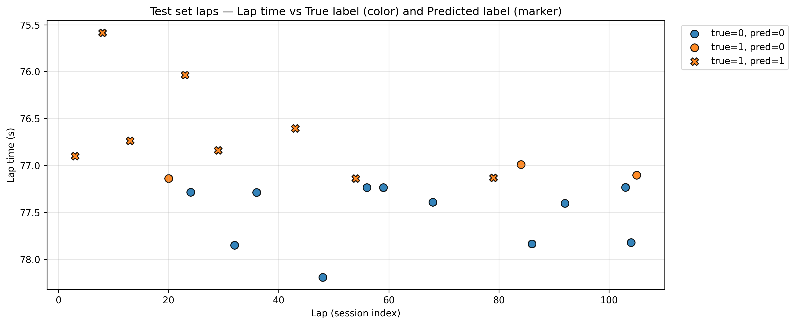
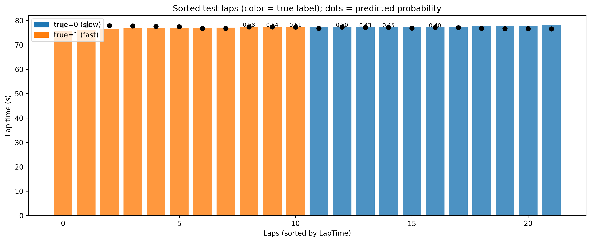

# 🏎️ F1 Fast Lap Classifier — Neural Network from Scratch

**Author:** Hana Tharwat Othman Elzarka (ID 8159)  
**Course:** Deep Learning Assignment  
**Dataset:** FastF1 (F1 qualifying session data)

---

## 📘 Project Description
This project uses the **FastF1** library to collect real F1 lap data and trains a **simple neural network implemented from scratch (NumPy)** to classify whether a lap is *fast* or *not fast* based on lap features like sector times, average speed, tyre compound, etc.

---

## 🧠 Implementation Steps
1. Load and preprocess FastF1 session data.  
2. Engineer features (`SectorSum_s`, `ApproxSpeed`, `TyreLife`, etc.).  
3. Train a small neural network from scratch using gradient descent.  
4. Evaluate performance (accuracy, precision, recall).  
5. Visualize lap predictions (true vs predicted).

---

## 🧾 Results
| Metric | Value |
|---------|--------|
| Validation Accuracy | **1.000** |
| Test Accuracy | **0.864** |
| Precision | **1.000** |
| Recall | **0.727** |

---

### 📊 Visualizations
- **Lap Predictions Scatter:** shows lap times colored by true label, markers show predictions.  
  
- **Sorted Lap Times:** shows laps sorted by time with predicted probabilities overlayed.  
   

---

## ⚙️ How to Run
1. Open this notebook directly in Google Colab:  
   

2. Run all cells in order — the notebook will:
   - Download session data via FastF1  
   - Train the neural network  
   - Display results and graphs  

---

## 🧩 Requirements
fastf1
numpy
pandas
matplotlib
seaborn
scikit-learn

---

## 🪪 License
MIT License © 2025 Hana Tharwat Othman Elzarka

